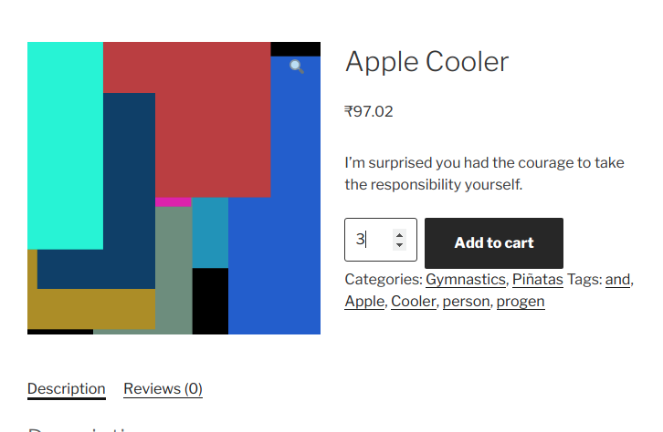
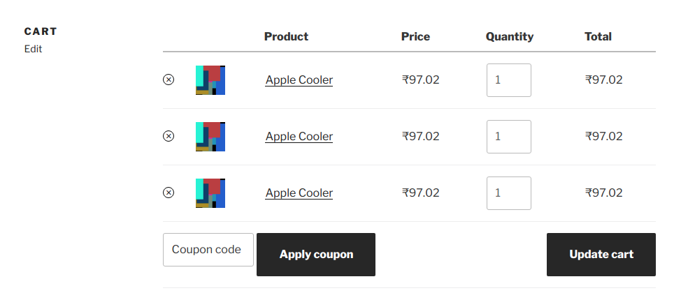

<h1> HACK #2 -While doing add to cart, split product added with more than 1 quanitity into multiple cart items</h1>

[](https://travis-ci.com/woo-hacks/split-multiple-qty-product-on-add-to-cart)

<p><b>Check the plugin code for usage.</b></p>

>`Don't get overwhelmed! Most of the file in this repo is related to unit testing or integrated build`.

<br/>
<strong>Following files are all that you need to get started : </strong>

```
woo-split-multiple-qty-cart-item/
├── class-split-multiple-qty-cart-item.php   (your intrested code)
└── init.php                                     (plugin main file)

```

**Main Action -**
```php
//loc: woocommerce/includes/class-wc-cart.php
do_action( 'woocommerce_add_to_cart', $cart_item_key, $product_id, $quantity, $variation_id, $variation, $cart_item_data );
```
<hr>


<p><center><b>1. Intial empty cart</b></center></p>
<hr>


<p><center><b>2. Adding Multiple Product to cart</b></center></p>
<hr>


<p><center><b>3. Final Cart</b></center></p>
<hr>
